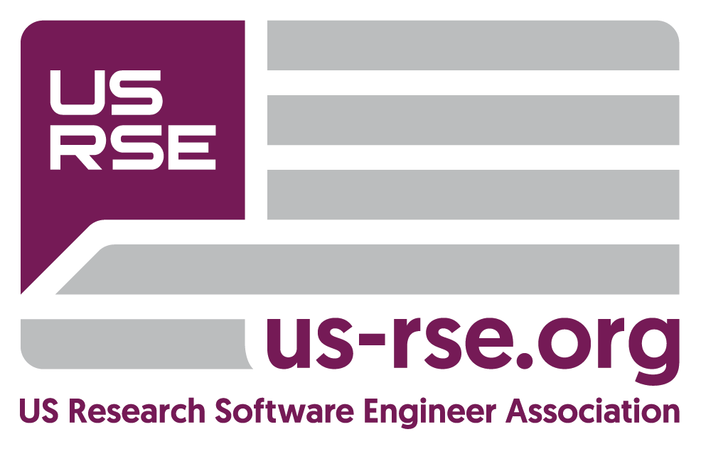
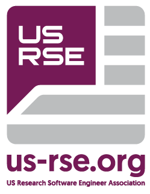

# US-RSE Logos

This is a repository of logos and other associated branding files with the logo for the US-RSE organization (https://us-rse.org).  It is not for other graphics: only items with the US-RSE logo.  

Current logo files (new logo as of September 2021) are in `current_logo/`.  Do not use logos in directories other than `current_logo/` for new things.

## Versions

There are two main versions of the logo:

### Square

The square can also have the organizational name to the side:

### Circle

### Others

#### With URL

Two versions that incorporate the URL, useful for applications such as stickers.  These versions are not preferred for slides or websites.  

#### Callout

The callout alone (`current_logo/callout/`) should only be used if there isn't space for the full logo.

#### Other Versions

If you would like a different version of the logo or have a question, please email contact@us-rse.org.  

## Colors

The pink in the logos is #741755.  The light gray is #b0b5b7.  

Closest pantone color (for printing) is 7650 C.

The logos can be rendered in all white for use on dark backgrounds.  See `current_logos/for_dark_backgrounds/` for some options.

## Fonts

The text in the callout uses BITSUMISHI Geomanist.

The text for the organization name in logo_side.pdf is Helvetica neue bold.  Other text (urls) also seems to be Helevetica neue, although sometimes squished a bit.  

